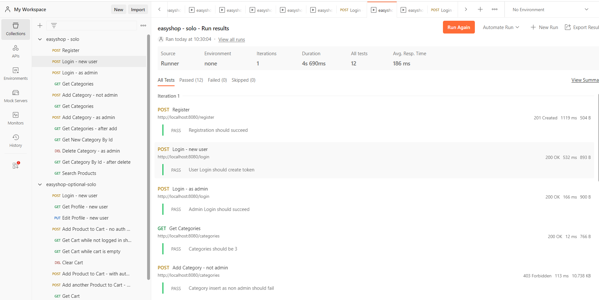

# EasyShop Backend
This is a Java e-commerce application using RESTFul API allowing users to register, login, and browse categories. Future additions to come.

## Bugs: First Bug(Search Functionality)
### The search method accepts four parameters: categoryId, minPrice, maxPrice, and color

But it does not pass the needed maxPrice parameter inside the PreparedStatement

So to fix, we pass the parameter inside the PreparedStatement.

## Bugs: Second Bug(Updating Products)
The updateProduct method body uses the productDao.create method implementation instead of the .update method implementation

To fix we use the .update method implementation instead

## Postman Testing
This API Application relies on Postman testing to ensure application endpoints and logic are fully functional.

## Acknowledgements 
I'd like to give a bunch of thanks to our instructor Paul as well as my Pluralsight classmates who me helped along the way. You guys are the best.